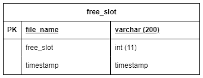

# Readme

How to setup:

1. Clone this Repo 
2. Clone YOLOv7 Repo from [https://github.com/WongKinYiu/yolov7](https://github.com/WongKinYiu/yolov7) into this repository, the layout should be like this
    1. TELEGRAM-BOT-PYTHON
        1. yolov7
3. Install all of the requirements for YOLOv7 (I recommend using NVIDIA GPU and Python v3.9)
4. Install all of the requirements for TELEGRAM-BOT-PYTHON
5. Create a copy of env.py.example file with name env.py ( fill all the necessary field)
6. Create a new DB for the application
    
    
    
7. Run the capture_image.py
8. Run the telegram_bot_skripsi.py
9. Done! 🚀